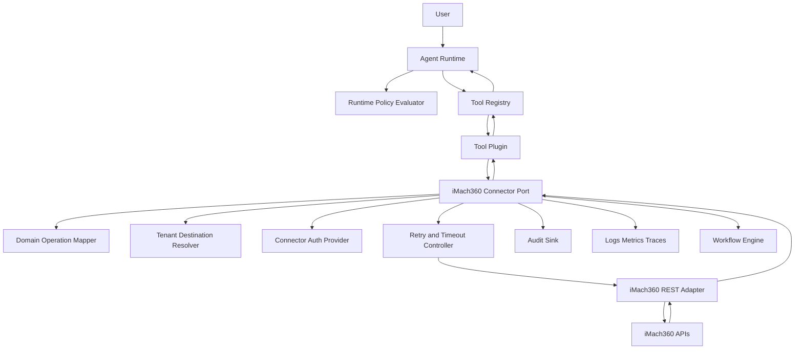
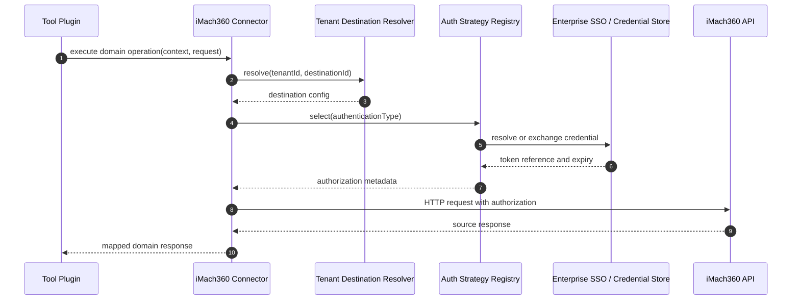
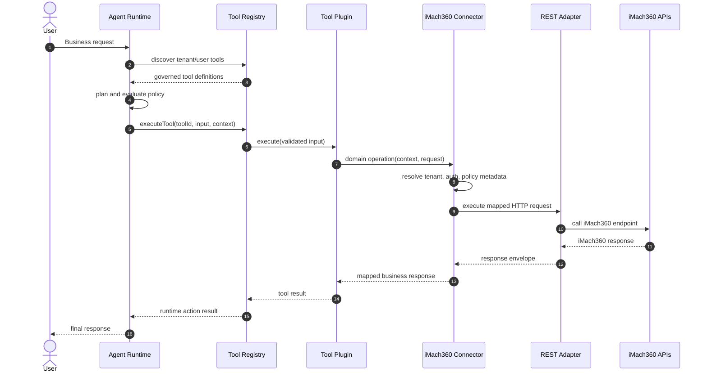
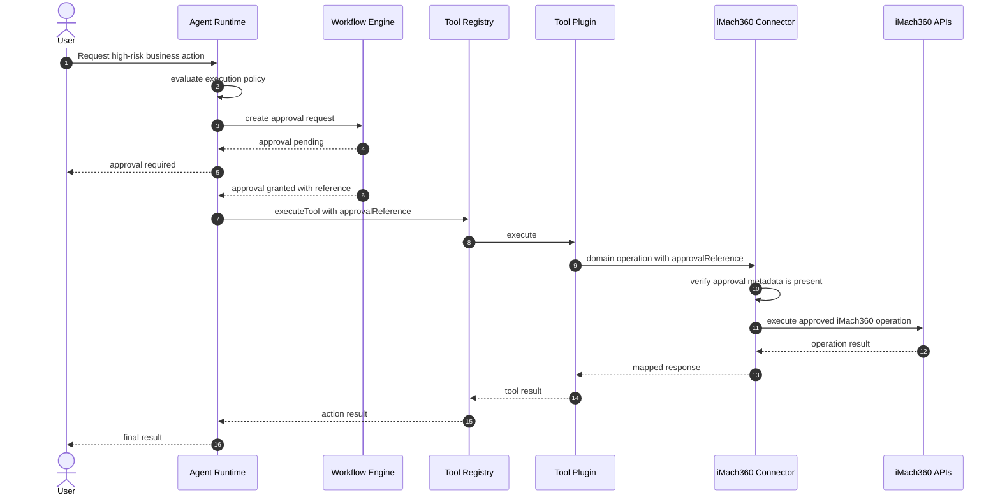
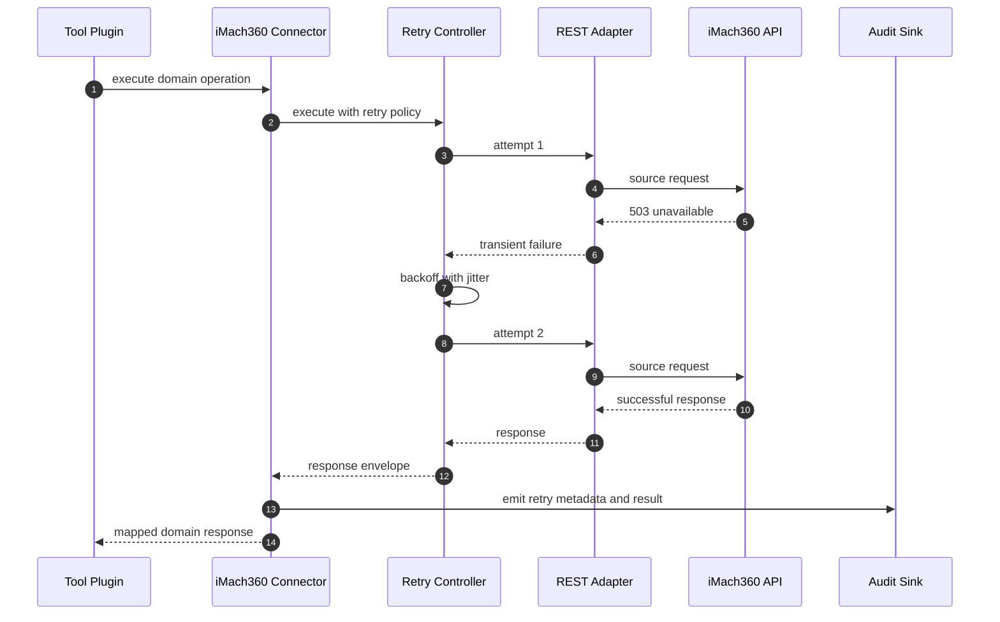

# iMach360 Connector Architecture

## 1. Purpose

The iMach360 Connector is the governed integration boundary between iPanda enterprise tools and iMach360 business APIs.

The required execution path is:

```text
Agent Runtime -> Tool Registry -> iMach360 Connector -> iMach360 APIs
```

The Agent Runtime must never call iMach360 APIs directly. Runtime planning, policy evaluation, and response composition remain in the Agent Runtime. Source-system authentication, request mapping, transport execution, retries, error normalization, audit enrichment, and observability belong inside the iMach360 Connector boundary.

This architecture is designed to support future SAP integration, multi-tenant deployments, enterprise SSO, workflow approvals, and future multi-agent orchestration.

## 2. Architecture Principles

- **Connector isolation**: iMach360 API routes, tokens, payloads, and transport details must not leak into Agent Runtime.
- **Governed tools first**: Tools reference connector capabilities through the Tool Catalog Standard, not raw source-system endpoints.
- **Tenant-aware by default**: Every connector request must carry tenant context and resolve tenant-specific destination and credentials.
- **Deterministic enforcement**: Authorization, approval, retry, and audit behavior must be enforced by policy and connector rules, not LLM judgment.
- **SAP-compatible pattern**: Connector boundaries should mirror the SAP connector style so future connectors share common platform contracts.
- **Observable execution**: Every connector operation must be traceable from user request through tool execution and source-system call.

## 3. Component Diagram



## 4. Connector Boundaries

### Agent Runtime Boundary

The Agent Runtime owns:

- User request intake.
- Execution context creation.
- Tool discovery through the Tool Registry.
- Tool selection and runtime planning.
- Deterministic governance evaluation.
- User confirmation handling.
- Final response composition.

The Agent Runtime must not own:

- iMach360 endpoint URLs.
- iMach360 request payload construction.
- iMach360 authentication tokens.
- iMach360 response mapping.
- Source-system retry rules.

### Tool Registry Boundary

The Tool Registry owns:

- Governed tool discovery.
- Tool metadata and execution policy exposure.
- Dispatch to registered tool plugins.
- Tool-level input and output validation.

Tool plugins may depend on the iMach360 Connector Port, but must not call iMach360 APIs directly.

### iMach360 Connector Boundary

The iMach360 Connector owns:

- Domain-level iMach360 operations.
- Tenant destination resolution.
- Authentication strategy selection.
- Request mapping from iPanda contracts to iMach360 API payloads.
- Response mapping from iMach360 payloads to iPanda contracts.
- Connector-specific retries and timeouts.
- Connector error normalization.
- Connector audit enrichment.
- Connector-level observability.

### Adapter Boundary

Adapters own low-level mechanics:

- HTTP method, path, headers, query, and body.
- Timeout enforcement.
- Network failure handling.
- Response status and body parsing.
- Safe diagnostic metadata.

Adapters must not own business authorization, tool policy, or LLM-facing behavior.

### Business-System Boundary

iMach360 owns:

- Source-system data.
- Source-system roles and server-side authorization.
- Business workflow state.
- API route behavior.
- Microsoft Graph and OneDrive file integrations used by iMach360.

iPanda must treat iMach360 as an external source system even when both systems are deployed by the same enterprise.

## 5. Interface Definitions

The following pseudo-TypeScript definitions describe the future contract shape. They are architecture definitions only, not implementation code.

```typescript
type iMach360OperationType = "read" | "create" | "update" | "delete" | "workflow" | "approval";

interface iMach360ConnectorContext {
  tenantId: string;
  userId: string;
  sessionId?: string;
  correlationId: string;
  toolId?: string;
  approvalReference?: string;
  delegatedUserTokenRef?: string;
  runtimeMetadata?: Record<string, unknown>;
}

interface iMach360DestinationConfig {
  tenantId: string;
  destinationId: string;
  baseUrl: string;
  authenticationType: iMach360AuthenticationType;
  defaultHeaders?: Record<string, string>;
  timeoutMs: number;
  rateLimitProfile: string;
}

type iMach360AuthenticationType =
  | "service-jwt"
  | "delegated-user-jwt"
  | "microsoft-sso-token-exchange"
  | "oauth2-client-credentials";

interface iMach360AuthStrategy {
  supports(authenticationType: iMach360AuthenticationType): boolean;
  resolveAuthorization(context: iMach360ConnectorContext, destination: iMach360DestinationConfig): Promise<iMach360Authorization>;
}

interface iMach360Authorization {
  scheme: "Bearer";
  tokenRef: string;
  expiresAt?: string;
  subjectType: "service" | "delegated-user";
  safeMetadata?: Record<string, unknown>;
}

interface iMach360RequestEnvelope<TPayload = unknown> {
  context: iMach360ConnectorContext;
  operationType: iMach360OperationType;
  method: "GET" | "POST" | "PUT" | "PATCH" | "DELETE";
  path: string;
  query?: Record<string, string | number | boolean>;
  payload?: TPayload;
  idempotencyKey?: string;
  expectedStatusCodes: number[];
}

interface iMach360ResponseEnvelope<TData = unknown> {
  statusCode: number;
  data: TData;
  sourceSystem: "iMach360";
  sourceEndpoint: string;
  correlationId: string;
  latencyMs: number;
  safeMetadata?: Record<string, unknown>;
}
```

## 6. Connector Contracts

Domain capability contracts should expose business operations, not raw API details. The initial connector should group iMach360 capabilities by the source API domains documented in `imach360.md`.

```typescript
interface iMach360LeaveConnector {
  listLeaves(context: iMach360ConnectorContext, request: ListLeavesRequest): Promise<ListLeavesResponse>;
  getLeaveById(context: iMach360ConnectorContext, request: GetLeaveByIdRequest): Promise<GetLeaveByIdResponse>;
  createLeaveRequest(context: iMach360ConnectorContext, request: CreateLeaveRequest): Promise<CreateLeaveResponse>;
  updateLeaveDecision(context: iMach360ConnectorContext, request: UpdateLeaveDecisionRequest): Promise<UpdateLeaveDecisionResponse>;
}

interface iMach360HrConnector {
  getEmployeeProfile(context: iMach360ConnectorContext, request: GetEmployeeProfileRequest): Promise<GetEmployeeProfileResponse>;
  listEmployees(context: iMach360ConnectorContext, request: ListEmployeesRequest): Promise<ListEmployeesResponse>;
  createEmployeeRecord(context: iMach360ConnectorContext, request: CreateEmployeeRecordRequest): Promise<CreateEmployeeRecordResponse>;
  updateEmployeeRecord(context: iMach360ConnectorContext, request: UpdateEmployeeRecordRequest): Promise<UpdateEmployeeRecordResponse>;
}

interface iMach360AssetConnector {
  listAssets(context: iMach360ConnectorContext, request: ListAssetsRequest): Promise<ListAssetsResponse>;
  getAssignedAssets(context: iMach360ConnectorContext, request: GetAssignedAssetsRequest): Promise<GetAssignedAssetsResponse>;
  assignAsset(context: iMach360ConnectorContext, request: AssignAssetRequest): Promise<AssignAssetResponse>;
  completeAssetReturn(context: iMach360ConnectorContext, request: CompleteAssetReturnRequest): Promise<CompleteAssetReturnResponse>;
}

interface iMach360TicketConnector {
  listTickets(context: iMach360ConnectorContext, request: ListTicketsRequest): Promise<ListTicketsResponse>;
  createTicket(context: iMach360ConnectorContext, request: CreateTicketRequest): Promise<CreateTicketResponse>;
  updateTicket(context: iMach360ConnectorContext, request: UpdateTicketRequest): Promise<UpdateTicketResponse>;
}

interface iMach360ExpenseConnector {
  listExpenseClaims(context: iMach360ConnectorContext, request: ListExpenseClaimsRequest): Promise<ListExpenseClaimsResponse>;
  createExpenseClaim(context: iMach360ConnectorContext, request: CreateExpenseClaimRequest): Promise<CreateExpenseClaimResponse>;
  updateExpenseDecision(context: iMach360ConnectorContext, request: UpdateExpenseDecisionRequest): Promise<UpdateExpenseDecisionResponse>;
}

interface iMach360NotificationConnector {
  getPendingCount(context: iMach360ConnectorContext): Promise<GetPendingCountResponse>;
  listPendingNotifications(context: iMach360ConnectorContext): Promise<ListPendingNotificationsResponse>;
}

interface iMach360FileConnector {
  uploadUserDocument(context: iMach360ConnectorContext, request: UploadUserDocumentRequest): Promise<UploadUserDocumentResponse>;
  uploadLeaveReceipt(context: iMach360ConnectorContext, request: UploadLeaveReceiptRequest): Promise<UploadLeaveReceiptResponse>;
  uploadTicketAttachment(context: iMach360ConnectorContext, request: UploadTicketAttachmentRequest): Promise<UploadTicketAttachmentResponse>;
  deleteFile(context: iMach360ConnectorContext, request: DeleteFileRequest): Promise<DeleteFileResponse>;
}

interface iMach360ConnectorPort
  extends iMach360LeaveConnector,
    iMach360HrConnector,
    iMach360AssetConnector,
    iMach360TicketConnector,
    iMach360ExpenseConnector,
    iMach360NotificationConnector,
    iMach360FileConnector {}
```

Forms, holidays, and resources should be added as connector domains when tools are approved for those iMach360 API groups.

## 7. Authentication Strategy

iMach360 currently supports JWT authentication and Microsoft OAuth-based login patterns. The connector architecture must support both current authentication and future Enterprise SSO.

### Authentication Modes

| Mode | Purpose | Use Case |
| --- | --- | --- |
| `service-jwt` | Connector-managed backend credential. | Scheduled, system-owned, or service-to-service operations. |
| `delegated-user-jwt` | User-scoped JWT passed or resolved by iPanda. | Acting with the user's iMach360 authority. |
| `microsoft-sso-token-exchange` | Enterprise SSO token exchanged for iMach360-compatible credential. | Future Microsoft Entra ID SSO propagation. |
| `oauth2-client-credentials` | Enterprise identity platform credential. | Future standardized connector auth across iMach360, SAP, HRMS, and ITSM. |

### Token Handling Rules

- Tokens must never be logged.
- Audit records may include token subject type and token reference, never raw token value.
- Tenant credentials must be resolved through tenant destination configuration.
- Delegated user token use must preserve the original `userId`, `tenantId`, and `correlationId`.
- Service credentials must be scoped to the minimum roles required by the connector operation.
- Connector auth errors must be normalized before returning to Tool Registry.

## 8. Authentication Flow



## 9. Request Lifecycle

1. User sends a request to the Agent Runtime.
2. Runtime creates execution context with tenant, user, session, and correlation identifiers.
3. Runtime discovers available tools through the Tool Registry.
4. Planner selects a tool using governed metadata from the Tool Catalog.
5. Runtime policy evaluator checks tenant scope, roles, permissions, risk, confirmation, approval, and frequency limits.
6. Tool Registry dispatches execution to the selected tool plugin.
7. Tool plugin validates tool input and calls the iMach360 Connector Port.
8. Connector resolves tenant destination configuration.
9. Connector resolves authentication using the configured strategy.
10. Connector maps domain request to iMach360 REST request.
11. Retry and timeout controller executes the request through the REST adapter.
12. Connector maps iMach360 response into the domain response contract.
13. Connector emits audit events and observability data.
14. Tool Registry returns the tool result to Agent Runtime.
15. Runtime merges result into execution context and composes the final response.

## 10. Tool Execution Sequence



## 11. Approval And Workflow Sequence

Approval-required tools must integrate with a Workflow Engine before source-system execution. The connector may receive an approval reference, but approval orchestration is owned outside the connector.



## 12. Error Handling And Retry Sequence



## 13. Retry Strategy

Retry behavior must be operation-aware.

| Operation Type | Default Retry Behavior | Requirements |
| --- | --- | --- |
| Read | Retry transient failures. | Retry timeout, network reset, 429, and 5xx responses. |
| Create | Do not retry by default. | Retry only when an idempotency key is provided and source behavior is safe. |
| Update | Do not retry by default. | Retry only when operation is idempotent or guarded by version checks. |
| Delete | Do not retry by default. | Manual review required for uncertain source-system state. |
| Workflow | Do not retry by default. | Use workflow status reconciliation instead of blind retries. |
| Approval | Do not retry by default. | Approval decisions must not be duplicated. |

Default retry policy:

- Maximum 2 attempts for retryable reads.
- Bounded exponential backoff with jitter.
- Respect iMach360 rate-limit responses.
- Stop retrying when authentication, authorization, validation, or business-rule failures occur.
- Emit retry count, retry reason, and final outcome in audit and metrics.

## 14. Error Taxonomy

All connector failures must be normalized before they leave the connector boundary.

| Error Code | Category | Retryable | Meaning |
| --- | --- | --- | --- |
| `IMACH360_TENANT_DESTINATION_NOT_FOUND` | Tenant Resolution | No | No iMach360 destination exists for the tenant. |
| `IMACH360_AUTHENTICATION_FAILED` | Authentication | No | Credential resolution, exchange, or token validation failed. |
| `IMACH360_AUTHORIZATION_FAILED` | Authorization | No | iMach360 rejected the caller or service credential. |
| `IMACH360_VALIDATION_FAILED` | Validation | No | Connector request did not satisfy expected contract. |
| `IMACH360_RATE_LIMITED` | Rate Limit | Yes | iMach360 returned rate limiting or throttling response. |
| `IMACH360_TIMEOUT` | Timeout | Yes for reads | Request exceeded configured timeout. |
| `IMACH360_NETWORK_ERROR` | Transport | Yes for reads | Network or DNS failure during source-system call. |
| `IMACH360_SOURCE_UNAVAILABLE` | Source System | Yes for reads | iMach360 returned 5xx or unavailable response. |
| `IMACH360_BUSINESS_RULE_FAILED` | Business Error | No | Source system rejected the operation for business reasons. |
| `IMACH360_NOT_FOUND` | Business Error | No | Target resource was not found. |
| `IMACH360_CONFLICT` | Business Error | No | Source state conflicts with requested operation. |
| `IMACH360_RESPONSE_MAPPING_FAILED` | Mapping | No | Source response could not be mapped safely. |
| `IMACH360_APPROVAL_REQUIRED` | Workflow | No | Operation requires approval before execution. |
| `IMACH360_APPROVAL_INVALID` | Workflow | No | Approval reference is missing, expired, denied, or not applicable. |
| `IMACH360_OPERATION_NOT_IMPLEMENTED` | Capability | No | Connector operation has been declared but not implemented. |
| `IMACH360_UNEXPECTED_ERROR` | Unknown | No | Unexpected connector failure. |

Raw iMach360 errors may be stored as safe diagnostic metadata, but must not expose tokens, secrets, stack traces, raw file contents, or unnecessary personal data to Agent Runtime.

## 15. Audit Strategy

The connector must emit audit events for:

- `imach360.connector.operation_requested`
- `imach360.connector.destination_resolved`
- `imach360.connector.authentication_resolved`
- `imach360.connector.request_mapped`
- `imach360.connector.request_started`
- `imach360.connector.request_retried`
- `imach360.connector.request_completed`
- `imach360.connector.request_failed`
- `imach360.connector.response_mapped`

Minimum logged fields:

- `tenantId`
- `userId`
- `sessionId`
- `correlationId`
- `toolId`
- `connectorName`
- `connectorOperation`
- `operationType`
- `sourceSystem`
- `sourceEndpoint`
- `authSubjectType`
- `policyDecision`
- `approvalReference`
- `retryCount`
- `resultStatus`
- `errorCode`
- `latencyMs`

Audit payloads must use summaries or masked values for sensitive data. File contents, bearer tokens, password fields, raw identity proofs, payslips, receipts, and full profile payloads must not be logged.

## 16. Observability Strategy

The connector must emit structured telemetry at runtime, registry, connector, adapter, and source-call levels.

### Logs

Logs must include:

- `correlationId`
- `tenantId`
- `connectorOperation`
- `sourceEndpoint`
- `resultStatus`
- `errorCode`
- `latencyMs`
- `retryCount`

Logs must not include raw tokens or sensitive payloads.

### Metrics

Recommended metrics:

- `imach360_connector_requests_total`
- `imach360_connector_failures_total`
- `imach360_connector_latency_ms`
- `imach360_connector_retries_total`
- `imach360_connector_rate_limited_total`
- `imach360_connector_auth_failures_total`
- `imach360_connector_mapping_failures_total`
- `imach360_connector_approval_required_total`

Metrics should be tagged by tenant, operation, source endpoint, result status, and error category where cardinality remains safe.

### Tracing

Each tool execution should create trace spans for:

- Runtime tool planning.
- Tool Registry dispatch.
- Tool plugin execution.
- Connector domain operation.
- Tenant destination resolution.
- Authentication resolution.
- HTTP adapter call.
- Response mapping.

The trace must preserve the runtime correlation ID across all spans.

## 17. iMach360 API Domain Mapping

Initial connector domains should map to iMach360 API groups as follows:

| Connector Domain | iMach360 API Group | Example Operations |
| --- | --- | --- |
| Leave | `/api/leaves` | List leaves, get leave, create leave request, approve or reject leave |
| HR | `/api/hr` | Get employee profile, list employees, create or update HR record |
| Asset | `/api/assets` | List assets, assign asset, initiate return, complete return |
| Ticket | `/api/tickets` | Create ticket, list tickets, update status, add resolution |
| Expense | `/api/expenses` | Submit expense claim, list claims, approve or reject claim |
| Notification | `/api/notifications` | Get pending count, list pending notifications |
| File | `/api/files` | Upload profile picture, receipts, documents, ticket attachments |
| Form | `/api/forms` | Submit response, send form, review form |
| Resource | `/api/resources` | List resources, update availability, add project |
| Holiday | `/api/holidays` | List, create, update, delete holidays |

Connector operations should use business names such as `createLeaveRequest` or `assignAsset`, while endpoint details remain inside request mappers.

## 18. Enterprise Deployment Requirements

- Tenant destination configuration must be externalized and environment-specific.
- Secrets must be stored in an approved credential store, not plain environment files.
- Connector operations must support per-tenant rate limiting.
- Health checks should distinguish connector process health from iMach360 source availability.
- Deployment must support rotation of connector credentials without code changes.
- Critical operations should support workflow approval references.
- File operations must enforce stricter logging and payload masking rules.
- Source-system authorization failures must be reported as access failures, not generic connector failures.

## 19. Compatibility With Future SAP Integration

The iMach360 Connector should follow the same architectural pattern as the SAP Connector:

- Application-facing connector port.
- Tenant destination resolver.
- Pluggable authentication strategies.
- REST or protocol adapter.
- Domain-level operations.
- Normalized connector errors.
- Safe diagnostic metadata.

A future common connector framework may extract shared abstractions for tenant destination resolution, auth strategy selection, retries, audit emission, and observability while keeping SAP and iMach360 domain contracts separate.

## 20. Acceptance Criteria

The connector architecture is ready for implementation when:

- No runtime or tool directly references raw iMach360 endpoints.
- All iMach360 source calls are represented by connector domain operations.
- Authentication strategy supports tenant credentials, delegated user JWT, and future Enterprise SSO.
- Retry behavior is operation-aware and safe for non-idempotent actions.
- Error taxonomy maps source, auth, validation, workflow, timeout, and transport errors.
- Audit and observability fields are sufficient to trace every request end to end.
- Workflow approval references can be carried into connector execution.
- The architecture remains compatible with future SAP, HRMS, ITSM, and multi-agent connectors.

