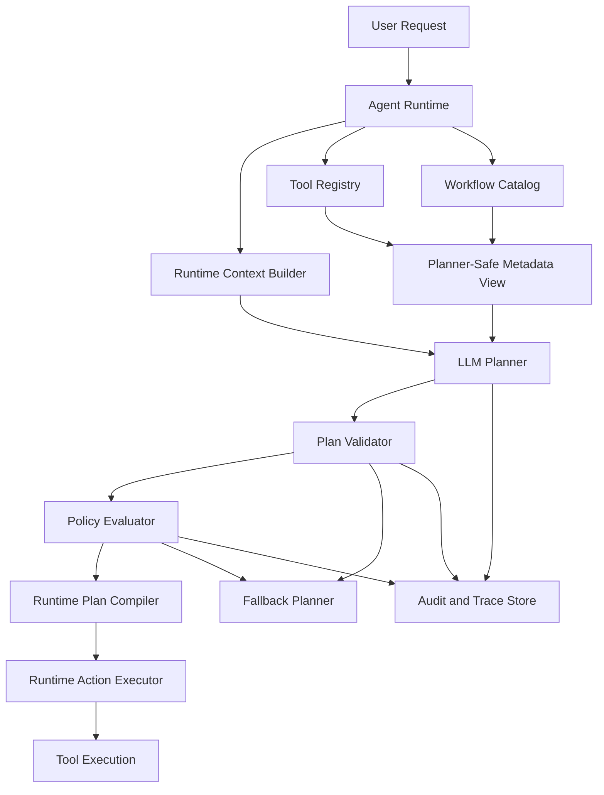
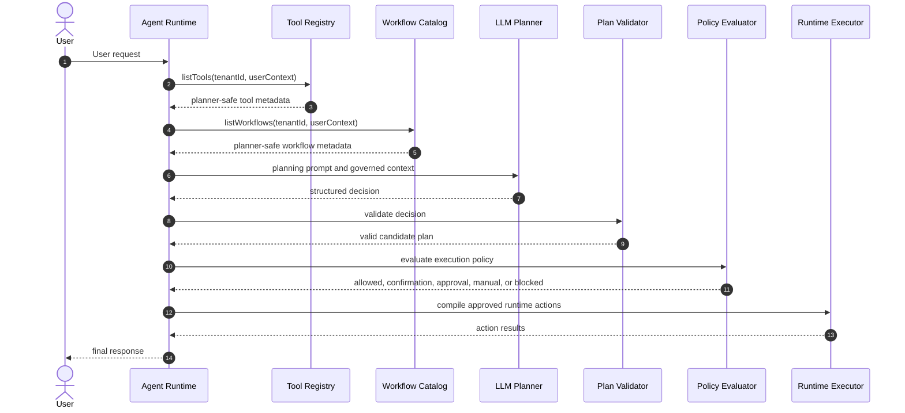

# LLM Planning Layer Architecture

## 1. Purpose

The LLM Planning Layer is the governed decision layer that converts a user request into structured planning decisions for the iPanda Agent Runtime.

The target flow is:

```text
User Request -> LLM Planner -> Tool Selection -> Agent Runtime -> Tool Execution
```

The LLM Planner must never directly execute tools. It must never call connectors, APIs, SAP, iMach360, HRMS, ITSM, or business systems. Its only responsibility is to produce structured planning decisions that the Agent Runtime can validate, approve, reject, or convert into runtime actions.

The Agent Runtime remains the authoritative execution boundary.

## 2. Architecture Principles

- **Planning only**: The LLM selects candidate tools or workflows, but never executes them.
- **Runtime authority**: Agent Runtime validates every planning decision before creating actions.
- **Catalog-bound selection**: The LLM may only select tools and workflows supplied by the Tool Registry.
- **No hallucinated tools**: Unknown tool IDs, workflow IDs, fields, permissions, or connector operations must be rejected.
- **Policy-aware but not policy-authoritative**: The LLM may estimate execution policy, but deterministic runtime policy decides.
- **Least-risk preference**: When multiple tools satisfy intent, prefer the lowest-risk valid candidate.
- **Auditable decisions**: Tool candidates, confidence scores, validation outcomes, and rejected plans must be traceable.

## 3. Component Architecture



## 4. Core Responsibilities

| Component | Responsibility |
| --- | --- |
| Runtime Context Builder | Builds tenant, user, session, request, conversation, memory, knowledge, and runtime option context. |
| Tool Catalog Provider | Supplies only tenant-visible and user-visible tools from the Tool Registry. |
| Workflow Catalog Provider | Supplies only workflows available to the current tenant, user, and policy context. |
| Planner-Safe Metadata View | Reduces tool and workflow metadata to fields safe and useful for LLM planning. |
| LLM Planner | Produces structured candidate decisions with confidence scores and reasons. |
| Plan Validator | Validates planner output against schema, known tools, known workflows, and allowed fields. |
| Policy Evaluator | Enforces tenant, role, permission, risk, confirmation, approval, and frequency rules. |
| Runtime Plan Compiler | Converts validated and policy-approved decisions into runtime actions. |
| Fallback Planner | Handles invalid output, low confidence, unavailable LLM provider, or unsupported requests. |
| Audit and Trace Store | Records planner inputs, candidate selections, confidence, validation, policy result, and final action decisions. |

## 5. Planner Decision Contract

The planner must return structured decisions only. The shape below is an architecture contract, not implementation code.

```typescript
interface PlannerDecision {
  requestId: string;
  intent: string;
  decisionType:
    | "tool_execution"
    | "workflow_execution"
    | "knowledge_retrieval"
    | "direct_response"
    | "clarification_required";
  confidence: number;
  reason: string;
  candidateTools: PlannerToolCandidate[];
  candidateWorkflows: PlannerWorkflowCandidate[];
  requiredInputs: PlannerInputRequirement[];
  missingInputs: PlannerInputRequirement[];
  executionPolicyExpectation:
    | "auto_execute"
    | "confirmation_required"
    | "approval_required"
    | "manual_only"
    | "not_applicable";
  riskSignals: string[];
  constraints: string[];
  safeResponseHint?: string;
}

interface PlannerToolCandidate {
  toolId: string;
  toolName: string;
  confidence: number;
  rank: number;
  reason: string;
  proposedInput: Record<string, unknown>;
  missingInputs: string[];
  expectedExecutionPolicy: string;
}

interface PlannerWorkflowCandidate {
  workflowId: string;
  workflowName: string;
  confidence: number;
  rank: number;
  reason: string;
  missingInputs: string[];
  expectedExecutionPolicy: string;
}

interface PlannerInputRequirement {
  name: string;
  reason: string;
  source: "user" | "runtime_context" | "memory" | "knowledge" | "tool_schema";
}
```

The planner output must not include:

- Direct tool execution calls.
- Connector endpoints.
- API URLs.
- HTTP payloads intended for business systems.
- Credentials or token references.
- Unregistered tool IDs.
- Unregistered workflow IDs.
- Authorization decisions.

## 6. Prompt Design

### System Instructions

The planner system prompt must establish these rules:

- You are an enterprise planning engine, not an executor.
- Select only from the provided tools and workflows.
- Never invent tools, workflows, permissions, connector operations, endpoints, or fields.
- Return only structured planning decisions.
- Never call or execute a tool.
- Prefer clarification when required inputs are missing.
- Prefer the lowest-risk valid candidate when multiple candidates satisfy the user request.
- Treat create, update, delete, approval, and workflow operations as confirmation-required or approval-required unless catalog metadata says otherwise.
- Do not override runtime policy.
- If no tool or workflow fits, choose `direct_response` or `clarification_required`.

### Prompt Inputs

The prompt should include:

1. Planning instructions.
2. Required output schema.
3. Tenant and user governance summary.
4. User request.
5. Recent conversation/task summary.
6. Available planner-safe tools.
7. Available planner-safe workflows.
8. Relevant knowledge snippets, if any.
9. Runtime options, such as whether tool execution is allowed.
10. Current date and time when temporal interpretation is required.

### Prompt Output

The LLM must return one structured planning object that conforms to the planner decision contract. Free-form prose should not be accepted as a valid planner result.

## 7. Context Strategy

The planner context must be minimal, relevant, and governed.

Include:

- Tenant ID and user ID as opaque identifiers when needed for planning.
- User roles and permissions summary.
- Session/task summary.
- User request.
- Planner-safe tool metadata.
- Planner-safe workflow metadata.
- Relevant memory summaries.
- Relevant knowledge retrieval summaries.
- Runtime options and constraints.

Exclude:

- Raw credentials.
- Raw access tokens.
- Connector secrets.
- Full audit logs.
- Raw source-system payloads.
- Raw file contents.
- Business-system API endpoints unless explicitly safe for documentation-only planning; runtime planning should not require them.

The context builder should prefer short summaries over long transcripts. Conversation history should be reduced to unresolved intent, known entities, prior confirmations, prior approvals, and active workflow state.

## 8. Tool Metadata Strategy

The LLM Planner must receive a planner-safe view derived from the Tool Catalog Standard.

Planner-safe tool metadata:

- `toolId`
- `toolName`
- `version`
- `domain`
- `category`
- `businessPurpose`
- `toolDescriptionForLlm`
- `exampleUserQueries`
- `toolSelectionKeywords`
- `toolSelectionConstraints`
- `requiredFields`
- `optionalFields`
- `inputFieldDescriptions`
- `riskClassification`
- `executionPolicy`
- `requiresUserConfirmation`
- `requiresManagerApproval`
- `requiresHumanReview`
- `dataSensitivityClassification`

Planner-hidden metadata:

- API endpoints.
- Authentication type.
- Connector credentials.
- Raw connector mappings.
- Retry internals.
- Secret names.
- Full audit configuration.
- Internal transport details.

Tool metadata should be normalized before prompting so the LLM sees consistent naming, compact descriptions, and explicit selection constraints.

## 9. Workflow Metadata Strategy

Workflow selection should use the same planning pattern as tool selection.

Planner-safe workflow metadata:

- `workflowId`
- `workflowName`
- `domain`
- `businessPurpose`
- `descriptionForLlm`
- `triggerExamples`
- `requiredInputs`
- `approvalSteps`
- `riskClassification`
- `executionPolicy`
- `selectionConstraints`
- `terminalStates`

Workflow metadata must make clear whether the planner is selecting:

- A workflow to start.
- A workflow step to continue.
- An approval to request.
- A human review path.
- A workflow status lookup.

The LLM may recommend a workflow candidate, but the Runtime must create or advance workflows through deterministic workflow orchestration.

## 10. Validation Strategy

Every LLM decision must pass deterministic validation.

Validation rules:

- Output must match the planner decision schema.
- `confidence` values must be numeric and within `0` to `1`.
- `decisionType` must be one of the allowed values.
- Every `toolId` must exist in the tenant/user-visible Tool Registry result.
- Every `workflowId` must exist in the tenant/user-visible Workflow Catalog result.
- Proposed tool input may include only fields declared by the selected tool input contract.
- Required tool inputs must be present or listed in `missingInputs`.
- Planner execution policy may not be less restrictive than catalog policy.
- Candidate rankings must be unique and ordered.
- Unknown tools, workflows, fields, roles, permissions, connectors, or endpoints invalidate the plan.
- Direct execution instructions invalidate the plan.

Invalid plans must not be compiled into runtime actions.

## 11. Hallucination Prevention Strategy

The system should prevent hallucination through layered controls:

- Limit prompt context to available tenant/user-visible tools and workflows.
- Require exact `toolId` and `workflowId` matching.
- Use schema-constrained structured output.
- Reject unknown identifiers.
- Reject invented fields.
- Reject direct connector or API references.
- Validate all proposed input against declared schemas.
- Compare planner policy expectation with catalog policy.
- Ask for clarification when confidence is low or inputs are missing.
- Log rejected planner output for audit and planner quality review.

The LLM may recommend a plan. It cannot authorize, approve, execute, or override policy.

## 12. Fallback Strategy

| Condition | Fallback |
| --- | --- |
| LLM provider unavailable | Use deterministic planner for known safe routes or return direct response. |
| Invalid planner output | Retry once with a stricter repair prompt, then use fallback planner. |
| Unknown tool or workflow selected | Reject plan and ask for clarification or return direct response. |
| Low confidence | Ask a concise clarification question. |
| Multiple close candidates | Prefer the lowest-risk read-only candidate or ask clarification. |
| Missing required inputs | Ask for missing fields before execution planning. |
| Tool execution disabled | Use direct response or explain the capability is unavailable. |
| Policy requires confirmation | Return confirmation-required decision; do not execute. |
| Policy requires approval | Return approval-required decision; do not execute. |
| Manual-only policy | Provide guidance without execution. |

Recommended confidence thresholds:

- `>= 0.85`: eligible for validation and policy evaluation.
- `0.60` to `0.84`: eligible only if a single low-risk candidate has complete inputs.
- `< 0.60`: clarification or fallback.

Runtime policy may still block any high-confidence plan.

## 13. Execution Policy Handling

The planner may classify expected execution policy, but Runtime decides the final policy.

Execution rules:

- `Auto Execute`: allowed only after validation and deterministic policy approval.
- `Confirmation Required`: Runtime must confirm action, target, and business effect with the user.
- `Approval Required`: Runtime must obtain or reference approval before compiling an execution action.
- `Manual Only`: Runtime must not execute the action; it may guide the user.
- Policy ambiguity must choose the more restrictive route.

Create, update, delete, workflow, and approval operations must never be auto-executed solely because the LLM is confident.

## 14. Runtime Integration Sequence



## 15. Audit Requirements

The planning layer must emit audit events for:

- `planner.context_built`
- `planner.prompt_sent`
- `planner.decision_received`
- `planner.validation_succeeded`
- `planner.validation_failed`
- `planner.policy_evaluated`
- `planner.fallback_used`
- `planner.plan_compiled`
- `planner.plan_rejected`

Minimum logged fields:

- `tenantId`
- `userId`
- `sessionId`
- `requestId`
- `correlationId`
- `decisionType`
- `candidateToolIds`
- `candidateWorkflowIds`
- `selectedToolId`
- `selectedWorkflowId`
- `confidence`
- `validationStatus`
- `policyDecision`
- `fallbackReason`
- `missingInputs`

Audit records must not include raw secrets, tokens, credentials, or unnecessary sensitive payloads.

## 16. Production Acceptance Criteria

The LLM Planning Layer is production-ready when:

- It selects only catalog-visible tools and workflows.
- It emits ranked candidates with confidence scores.
- It identifies missing required inputs.
- It supports tool, workflow, knowledge, direct response, and clarification decisions.
- It never directly executes tools.
- It never receives connector credentials or raw API execution details.
- Runtime validates every planner output before action creation.
- Runtime policy can override or reject every planner decision.
- Invalid, low-confidence, or hallucinated plans cannot reach execution.
- Planner decisions are auditable end to end.

