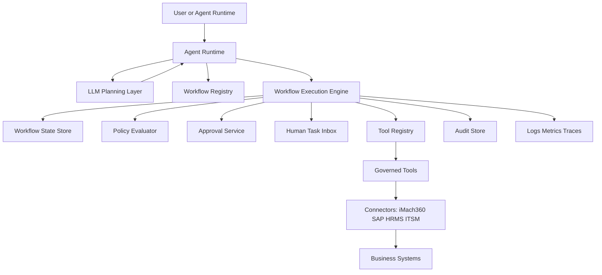
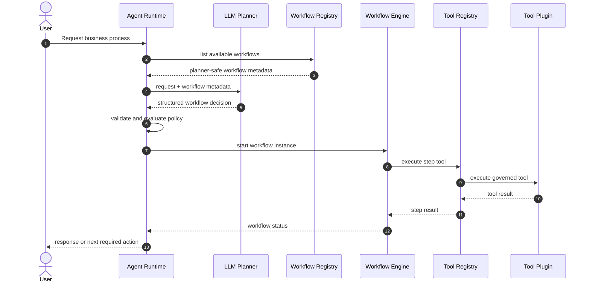

# Workflow Engine Architecture

## 1. Purpose

The iPanda Workflow Engine coordinates multi-step business processes composed of governed tools, approvals, human intervention points, and recovery rules.

A workflow is a durable business process definition, not a single tool call. Each workflow step may execute a tool through the Tool Registry, request approval, wait for a human task, evaluate a condition, or perform a compensating rollback action.

Example:

```text
Employee Onboarding
-> Create Employee
-> Assign Manager
-> Assign Asset
-> Notify HR
```

The Workflow Engine must support SAP, iMach360, HRMS, ITSM, and future external systems through the same governed connector and tool architecture used by the Agent Runtime.

## 2. Architecture Principles

- **Tools remain governed**: Workflow steps execute tools through the Tool Registry, never through direct connector or API calls.
- **Durable orchestration**: Workflow state must survive process restarts, retries, approvals, and human delays.
- **Policy-aware execution**: Each step must honor the Tool Catalog Standard, including role, permission, risk, confirmation, approval, and audit rules.
- **Human-compatible design**: Workflows must support approval, review, correction, delegation, escalation, and manual completion.
- **Recoverable by design**: Every mutating workflow must define failure handling and, where possible, compensating actions.
- **Connector-neutral**: Workflow definitions reference tool IDs and domains, not SAP, iMach360, or external API endpoints.
- **Auditable lifecycle**: Workflow definition, start, step execution, approval, failure, rollback, and completion must be traceable.

## 3. Component Architecture



## 4. Workflow Definition Standard

Every workflow definition must declare:

- Stable workflow ID.
- Workflow name and semantic version.
- Domain and business owner.
- Business purpose and related process.
- Trigger rules.
- Required roles and permissions.
- Tenant scope.
- Risk classification.
- Execution policy.
- Input contract.
- Step graph.
- Approval and human task rules.
- Timeout and retry rules.
- Rollback or compensation rules.
- Audit requirements.
- Observability tags.
- Lifecycle status.

Workflow definitions must be reviewed with the same discipline as tools. Any change to step order, tool IDs, approval rules, rollback behavior, or business outcome requires a version update.

## 5. Workflow DSL

The Workflow DSL should be declarative and connector-neutral. It may reference tools and workflows by ID, but must not reference raw APIs, URLs, credentials, or connector internals.

```yaml
workflow:
  workflowId: "employee-onboarding.v1"
  workflowName: "EmployeeOnboarding"
  version: "1.0.0"
  domain: "Employee Management"
  owner: "People Operations"
  lifecycleStatus: "active"

  businessContext:
    purpose: "Onboard a new employee across HR, management, assets, and notification processes."
    capability: "Employee onboarding"
    relatedProcesses:
      - "Employee record creation"
      - "Manager assignment"
      - "Asset allocation"
      - "HR notification"

  securityModel:
    requiredRoles:
      - "hr_admin"
    requiredPermissions:
      - "employee.create"
      - "employee.manager.assign"
      - "asset.assign"
      - "notification.send"
    tenantScope: "tenant"
    dataSensitivityClassification: "confidential"

  executionPolicy:
    riskClassification: "High Risk"
    startPolicy: "Approval Required"
    requiresUserConfirmation: true
    requiresManagerApproval: false
    requiresHumanReview: true
    maxRuntime: "5 business days"

  inputContract:
    requiredFields:
      - "employeeProfile"
      - "managerId"
      - "assetBundle"
      - "startDate"
    optionalFields:
      - "department"
      - "location"
      - "notificationRecipients"

  steps:
    - stepId: "create_employee"
      type: "tool"
      toolId: "employee.create-record.v1"
      inputMapping:
        employeeProfile: "$.input.employeeProfile"
        startDate: "$.input.startDate"
      onSuccess: "assign_manager"
      onFailure: "human_review"
      compensation:
        toolId: "employee.deactivate-record.v1"
        condition: "employeeCreated == true"

    - stepId: "assign_manager"
      type: "tool"
      toolId: "employee.assign-manager.v1"
      inputMapping:
        employeeId: "$.steps.create_employee.output.employeeId"
        managerId: "$.input.managerId"
      onSuccess: "assign_asset"
      onFailure: "rollback"

    - stepId: "assign_asset"
      type: "tool"
      toolId: "asset.assign.v1"
      inputMapping:
        employeeId: "$.steps.create_employee.output.employeeId"
        assetBundle: "$.input.assetBundle"
      onSuccess: "notify_hr"
      onFailure: "human_review"
      compensation:
        toolId: "asset.unassign.v1"
        condition: "assetAssigned == true"

    - stepId: "notify_hr"
      type: "tool"
      toolId: "notification.send.v1"
      inputMapping:
        subject: "Employee onboarding completed"
        employeeId: "$.steps.create_employee.output.employeeId"
        recipients: "$.input.notificationRecipients"
      onSuccess: "complete"
      onFailure: "manual_completion"

  humanTasks:
    - taskId: "human_review"
      title: "Review onboarding failure"
      assignedRole: "hr_admin"
      allowedActions:
        - "retry_step"
        - "skip_step"
        - "rollback"
        - "cancel_workflow"

  rollback:
    strategy: "compensating_actions"
    order: "reverse_completed_steps"
    manualReviewRequired: true

  audit:
    events:
      - "workflow.started"
      - "workflow.step.started"
      - "workflow.step.completed"
      - "workflow.approval.requested"
      - "workflow.human_task.created"
      - "workflow.rollback.started"
      - "workflow.completed"
      - "workflow.failed"
```

## 6. Workflow Step Types

| Step Type | Purpose | Execution Rule |
| --- | --- | --- |
| `tool` | Executes a governed tool through the Tool Registry. | Must pass tool policy and validation before execution. |
| `approval` | Requests approval from a manager, owner, or configured approver. | Workflow pauses until approval, rejection, timeout, or escalation. |
| `human_task` | Creates a manual intervention task. | Workflow pauses until an authorized user resolves the task. |
| `condition` | Branches based on workflow state or step output. | Must use deterministic expressions. |
| `wait` | Pauses until a time, event, or external signal. | Must define timeout and resume condition. |
| `subworkflow` | Starts another governed workflow. | Must preserve parent correlation and tenant context. |
| `notification` | Sends a governed notification. | Prefer notification tools rather than direct message services. |
| `rollback` | Runs compensation or manual recovery. | Must be auditable and policy-controlled. |

## 7. Workflow Registry

The Workflow Registry is the authoritative catalog for workflow definitions.

Responsibilities:

- Register workflow definitions.
- Validate DSL structure.
- Track workflow versions and lifecycle status.
- Expose planner-safe workflow metadata to the LLM Planning Layer.
- Expose executable workflow definitions to the Workflow Engine.
- Enforce tenant availability and user visibility.
- Prevent deprecated or disabled workflows from being started.

Planner-safe workflow metadata should include:

- `workflowId`
- `workflowName`
- `version`
- `domain`
- `businessPurpose`
- `descriptionForLlm`
- `triggerExamples`
- `requiredInputs`
- `approvalSteps`
- `riskClassification`
- `executionPolicy`
- `selectionConstraints`
- `terminalStates`

The Workflow Registry must not expose connector credentials, raw API endpoints, transport details, or internal secrets.

## 8. Workflow Execution Engine

The Workflow Execution Engine owns durable orchestration.

Core responsibilities:

- Start workflow instances.
- Validate workflow inputs.
- Persist workflow state.
- Resolve the next executable step.
- Execute tool steps through the Tool Registry.
- Pause and resume approval or human task steps.
- Apply retry and timeout rules.
- Trigger rollback or compensation.
- Mark workflow completion, cancellation, or failure.
- Emit audit and observability events.

Workflow instance states:

| State | Meaning |
| --- | --- |
| `pending` | Instance has been created but not started. |
| `running` | Engine is actively executing steps. |
| `waiting_for_approval` | Workflow is paused for approval. |
| `waiting_for_human` | Workflow is paused for manual intervention. |
| `waiting_for_event` | Workflow is paused for a time or external event. |
| `compensating` | Rollback or compensation is running. |
| `completed` | Workflow finished successfully. |
| `failed` | Workflow failed and cannot proceed automatically. |
| `cancelled` | Workflow was cancelled by policy or authorized user. |

## 9. Approval Model

Approval must be explicit, auditable, and separable from tool execution.

Approval types:

- User confirmation.
- Manager approval.
- Business owner approval.
- Security approval.
- Finance approval.
- HR approval.
- Multi-party approval.
- Human review before execution.

Approval records must include:

- Approval ID.
- Workflow instance ID.
- Step ID.
- Tenant ID.
- Requested by.
- Requested for.
- Approver role or user.
- Approval reason.
- Risk classification.
- Requested action summary.
- Decision: approved, rejected, expired, cancelled.
- Decision timestamp.
- Decision comments.

Approval rules:

- Approval must be obtained before the protected step executes.
- Approval references must be passed into tool execution context.
- Expired or rejected approvals must block execution.
- Approval cannot be inferred by the LLM.
- Approval decisions must not be retried blindly.
- High-risk approvals should support separation of duties, where requester and approver cannot be the same user.

## 10. Human Intervention Model

Human intervention is required when automation cannot safely continue.

Human tasks may be created for:

- Missing or ambiguous input.
- Validation failure.
- Business rule conflict.
- Source-system conflict.
- Partial completion.
- Failed rollback.
- Approval exception.
- Manual-only tool or workflow step.

Allowed human task actions should be explicit:

- Retry step.
- Edit input and retry.
- Skip step.
- Run compensation.
- Mark manually completed.
- Cancel workflow.
- Escalate.

Every human action must be permission-checked, audited, and attached to the workflow instance timeline.

## 11. Runtime Integration

The Agent Runtime integrates with workflows as a governed capability.



Runtime rules:

- Runtime may start, inspect, resume, or cancel workflow instances through Workflow Engine contracts.
- Runtime must not execute workflow steps itself.
- Runtime must not bypass Tool Registry for workflow tool steps.
- Runtime must preserve tenant, user, session, and correlation context.
- Runtime must surface approval or human task requirements to the user when needed.

## 12. Failure Recovery

Workflow failure recovery must be explicit in the DSL and enforced by the engine.

Failure categories:

| Failure | Recovery |
| --- | --- |
| Validation failure | Ask for corrected input or create human task. |
| Tool policy blocked | Stop workflow and return policy reason. |
| Approval rejected | Mark workflow rejected or route to alternate path. |
| Approval timeout | Escalate or cancel according to workflow policy. |
| Connector timeout | Retry if step is idempotent; otherwise human review. |
| Source-system conflict | Create human task with conflict summary. |
| Partial completion | Continue, compensate, or pause based on workflow definition. |
| Compensation failure | Escalate to manual recovery. |

Failure recovery must preserve the workflow timeline and never hide partial side effects.

## 13. Rollback Strategy

Rollback is compensation, not time travel. Many enterprise systems cannot truly undo a business action, so rollback must be designed as explicit compensating actions.

Supported rollback strategies:

| Strategy | Meaning |
| --- | --- |
| `none` | No rollback is available; human review required on failure. |
| `compensating_actions` | Run configured compensation tools in reverse order. |
| `manual_review` | Pause and assign a human recovery task. |
| `resume_from_checkpoint` | Retry from the last successful checkpoint. |
| `saga` | Treat each mutating step as a transaction with a matching compensation. |

Rollback rules:

- Compensation tools must be registered in the Tool Registry.
- Compensation steps must pass their own policy checks.
- Rollback must be auditable.
- Rollback must not execute critical actions automatically unless policy permits.
- If rollback cannot fully restore state, the workflow must expose residual risk in its final status.

## 14. Audit Strategy

Workflow audit must provide an end-to-end explanation of what happened, who approved it, what tools executed, and what systems were affected.

Audit events:

- `workflow.definition.registered`
- `workflow.instance.started`
- `workflow.input.validated`
- `workflow.policy.evaluated`
- `workflow.step.started`
- `workflow.step.completed`
- `workflow.step.failed`
- `workflow.approval.requested`
- `workflow.approval.completed`
- `workflow.human_task.created`
- `workflow.human_task.completed`
- `workflow.rollback.started`
- `workflow.rollback.completed`
- `workflow.rollback.failed`
- `workflow.instance.completed`
- `workflow.instance.failed`
- `workflow.instance.cancelled`

Minimum audit fields:

- `tenantId`
- `userId`
- `sessionId`
- `correlationId`
- `workflowId`
- `workflowVersion`
- `workflowInstanceId`
- `stepId`
- `stepType`
- `toolId`
- `approvalId`
- `humanTaskId`
- `policyDecision`
- `riskClassification`
- `inputSummary`
- `outputStatus`
- `errorCode`
- `rollbackStatus`
- `latencyMs`

Audit records must mask secrets, tokens, credentials, raw file contents, and unnecessary personal data.

## 15. Observability Strategy

The Workflow Engine must emit structured logs, metrics, and traces.

Recommended metrics:

- `workflow_instances_started_total`
- `workflow_instances_completed_total`
- `workflow_instances_failed_total`
- `workflow_step_executions_total`
- `workflow_step_failures_total`
- `workflow_approval_wait_time_ms`
- `workflow_human_task_wait_time_ms`
- `workflow_rollback_total`
- `workflow_rollback_failures_total`

Trace spans should include:

- Workflow start.
- Policy evaluation.
- Step selection.
- Tool Registry execution.
- Approval wait.
- Human task wait.
- Rollback execution.
- Workflow completion.

All logs and traces must preserve the runtime correlation ID.

## 16. External System Support

Workflow definitions must stay source-system neutral.

| System Type | Integration Rule |
| --- | --- |
| iMach360 | Execute through iMach360-backed tools and the iMach360 Connector. |
| SAP | Execute through SAP-backed tools and the SAP Connector. |
| HRMS | Execute through HRMS-backed tools and future HRMS connector. |
| ITSM | Execute through ITSM-backed tools and future ITSM connector. |
| External APIs | Execute only through governed connector-backed tools. |

Workflows must reference tool IDs, not connector names or API endpoints. Connector mapping remains inside tool and connector definitions.

## 17. Production Acceptance Criteria

The Workflow Engine architecture is production-ready when:

- Workflows are defined by versioned DSL documents.
- Workflow definitions reference governed tool IDs only.
- Workflow Registry controls lifecycle, visibility, and planner-safe metadata.
- Workflow Execution Engine persists durable state.
- Approval and human intervention can pause and resume instances.
- Tool steps execute only through the Tool Registry.
- Failures, retries, rollback, and compensation are explicit.
- Partial completion is visible and auditable.
- SAP, iMach360, and future external systems are supported through connectors.
- Runtime can start and observe workflows without owning step execution.

